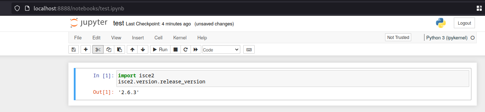

# Dev env for Wolfgangs SAR

## Setup

### Setup - easy way

Make sure you have direnv installed and that in your ``.bash_profile`` you have the following line:

```
eval "$(direnv hook bash)"

```

Use NixOS and nix-direnv
cd into this folder
do ``direnv allow``

### Setup - no direnv

If you do not have direnv, install the nix package manger (https://nixos.org/download) then do 

``nix-shell``

I have not tested on other OS, but if you have ubuntu, it should set everything up for you. But use NixOS....it should work without issue.

## Known issues

Currently there is a strange compilation error when building relating to missing Screenwriter.h

Actually the file is there and you can trivially resolve the issue by doing:

```
cd isce2/build/
make install
cd ../..
```

## What will get installed?

The ``setup.sh`` script will install these:

- ✅MINOPY (now known as MiaplPy)
- ✅ISCE (based on setup notes [here](https://github.com/isce-framework/isce2)),
- ✅FRINGE,
- ✅SNAPHU

Afterwards you can check the install by doing

``python test.py``

## Running in jupyter notebook

Currently does not work.

You can start the notebook like this:

``jupyter-lab``

It will open your browser with a jupyter environment.

There is a sample notebook that demonstrates using isce2:

``
test.ipynb
``

Just open it and run it to verify you have a working isce2 environment.


